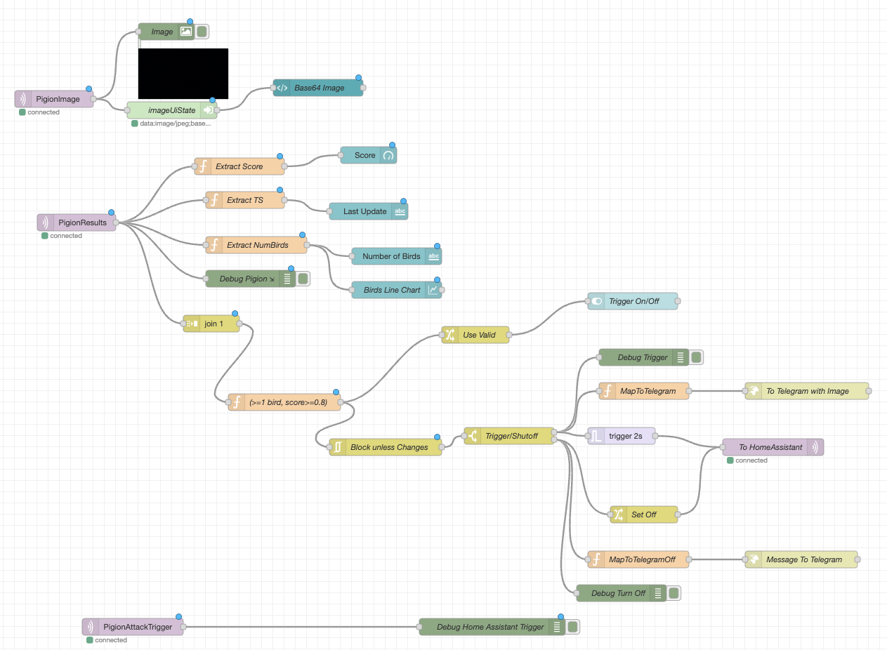
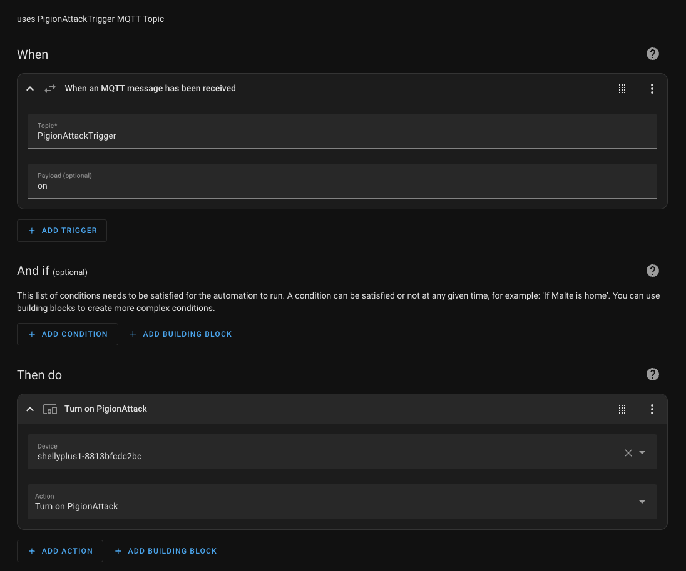
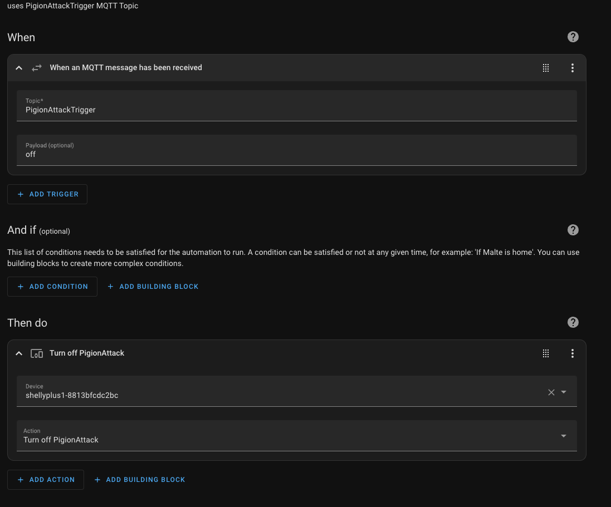

# Pigion Detector thats connected to Node Red to attach pigions with water spray

This respository contains the code for a home automation to detect pigions on my balcony using a camera attached to a raspberry pi and then to trigger a water pump which will spray water on the pigions to scare them away.

TODO Video ...

### Hardware setup
```bash
docker build --platform=linux/amd64 -t pigion-client ./ 
```

### Setup Raspberry pi

```bash
# Install system requirements
sudo apt-get install python3-pip python3-pillow  python3-venv python3-picamera2 --no-install-recommends

# setup virtual env
python3 -m venv --system-site-packages venv
source venv/bin/activate

# install packages faster with uv
pip install uv
uv pip install python-dotenv paho.mqtt

# start tmux session
python image_server.py
```

###  2. Setup .env file

```bash
touch .env
# MQTT_SERVER=192.168.178.35:1883
# TELEGRAM_TOKEN=...
# CHAT_ID=...
```

###  2. Build images and publish to registry


Build the client that runs the pigion detector (yolo11n - bird classs) and sends events to MQTT
```bash
docker build --platform=linux/amd64 -t pigion-client ./ 
docker image tag pigion-client 192.168.178.35:5000/pigion/pigion-client:latest
docker push 192.168.178.35:5000/pigion/pigion-client:latest
```


Telegram Server that can send messages to my phone
```bash
docker build --platform=linux/amd64 -t telegram-server -f Dockerfile.telegram ./
docker image tag telegram-server 192.168.178.35:5000/pigion/telegram-server:latest
docker push 192.168.178.35:5000/pigion/telegram-server:latest
```

### 3. Start those 2 services from the images build in previous step

```bash
docker run -itd --rm localhost:5000/pigion/pigion-client:latest
docker run -itd --rm -p 10008:8000 localhost:5000/pigion/telegram-server:latest
```

### 4. Setup Node-RED automation using MQTT Events

Flow: [Json](flows.json)
|Topic| Description|
| --- | ---        |
| PigionImage   | Image send from Raspberry Pi|
| PigionResults | Results from the yolo network (score, numBirds) |
| PigionAttackTrigger | on -> water gun active \ off -> water gun off |



### 5. Setup home assistant trigger

Include MQTT Broker and attach PigionAttackTrigger 'on' to trigger shellyplus switch to turn on the water pump.



